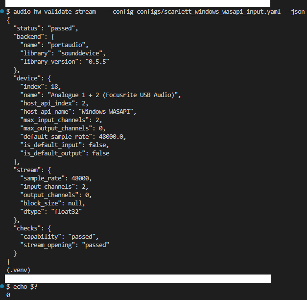
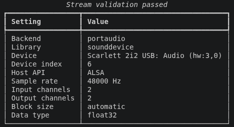
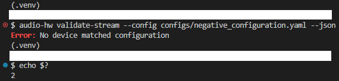
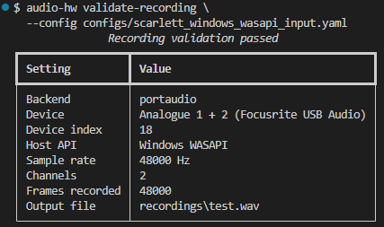
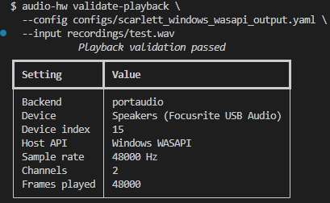
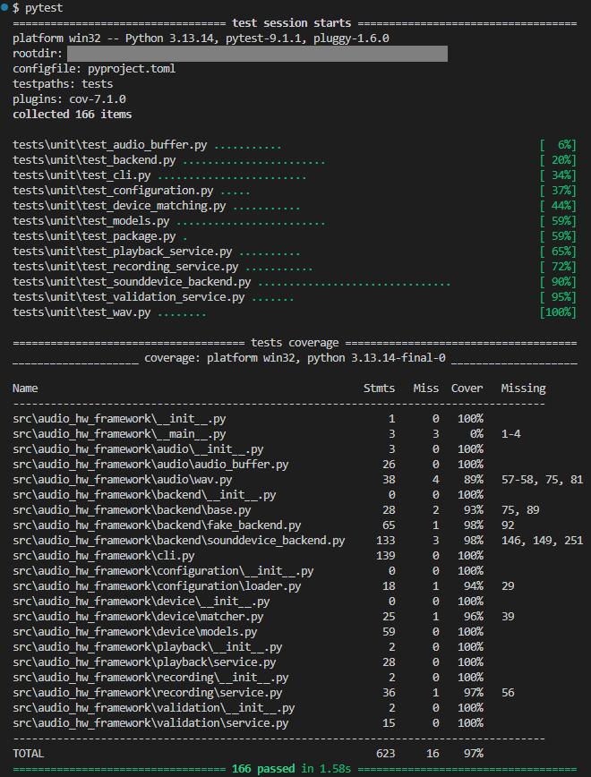

# Audio Hardware Automation Framework

[](https://github.com/rubiksfood/audio-hardware-automation-framework/actions/workflows/ci.yml)

A Python-based framework for automated audio hardware testing and validation.

This project demonstrates QA automation, hardware testing, configuration-driven validation, CI-friendly test design, and cross-platform audio device discovery. It is being developed as a portfolio project targeting Audio QA Engineer, Hardware QA Engineer, Embedded QA Engineer, and Software QA Engineer roles within the audio technology industry.

---

## Project Status

**Phase 4 complete — signal generation and sample-domain analysis**

Completed capabilities include:

- Cross-platform audio device discovery
- Host API-aware device matching
- Input-only, output-only, and duplex stream validation
- PortAudio capability checks
- Safe stream construction and closure
- Finite-duration recording
- Finite-buffer playback
- Framework-owned audio buffers
- WAV import and export
- Deterministic sine-wave and silence generation
- RMS, peak and DC offset analysis
- Silence and clipping detection
- Per-channel sample-domain metrics
- Configuration-driven metric thresholds
- Structured threshold failure reasons
- WAV analysis through the `analyse-audio` CLI command
- Backend-independent recording and playback services
- Rich CLI and structured JSON reporting
- Windows and Linux hardware validation

**Current development:** later-phase loopback, latency, stream-health and stability validation.

See the [Roadmap](#roadmap) for planned development.

---

## Project Goals

The framework aims to provide a reusable foundation for automated testing of audio hardware such as:

- Audio interfaces
- USB audio devices
- Embedded audio hardware
- Audio drivers
- Recording and playback systems

The current foundation includes reliable device discovery, configuration management, hardware identification, stream-capability validation, finite recording and playback, WAV handling, deterministic signal generation, sample-domain analysis, and configuration-driven metric validation.

Future releases will build on the current signal and analysis foundation with loopback testing, measured sample-rate verification, deeper audio-quality measurements, latency observation, and stability testing.

---

## Current Features

### Device Discovery

Enumerate audio devices through PortAudio using Python's `sounddevice` package.

The framework collects:

- Device name
- Host API name
- Host API index
- Input channel count
- Output channel count
- Default sample rate

Example:

```text
Index  Device                                Host API  Inputs  Outputs  Default Rate
0      Analogue 1 + 2 (Focusrite USB Audio)  WASAPI    2       0        48000 Hz
1      Speakers (Focusrite USB Audio)        WASAPI    0       2        48000 Hz
...
```

Example output shortened for readability.

Supported matching rules:

- Exact device name
- Partial device name
- Host API matching
- Minimum input channels
- Minimum output channels

Example:

```yaml
device:
  name_contains: "Focusrite USB Audio"
  host_api_contains: "WASAPI"
  minimum_input_channels: 2
```

This allows the framework to distinguish between multiple entries representing the same physical audio interface across different host APIs.

---

### Command-Line Interface

Inspect available audio devices:

```bash
audio-hw inspect-devices
```

Inspect devices using a configuration:

```bash
audio-hw inspect-devices --config configs/scarlett_windows_wasapi_input.yaml
```

Output JSON:

```bash
audio-hw inspect-devices --json
```

Validate a configured stream:

```bash
audio-hw validate-stream \
  --config configs/scarlett_windows_wasapi_input.yaml
```

Output validation results as JSON:

```bash
audio-hw validate-stream \
  --config configs/scarlett_windows_wasapi_input.yaml \
  --json
```

To create a WAV file for playback validation, first ensure the recording configuration contains an output path:

```yaml
execution:
  duration_seconds: 1.0
  timeout_seconds: 5.0
  output_file: recordings/test.wav
```

Then run recording validation:

```bash
audio-hw validate-recording \
  --config configs/scarlett_windows_wasapi_input.yaml
```

Then validate playback using the generated recording:

```bash
audio-hw validate-playback \
  --config configs/scarlett_windows_wasapi_output.yaml \
  --input recordings/test.wav
```

Output recording validation results as JSON:

```bash
audio-hw validate-recording \
  --config configs/scarlett_windows_wasapi_input.yaml \
  --json
```

Output playback validation results as JSON:

```bash
audio-hw validate-playback \
  --config configs/scarlett_windows_wasapi_output.yaml \
  --input recordings/test.wav \
  --json
```

Analyse a WAV file using configured sample-domain thresholds:

```bash
audio-hw analyse-audio \
  --config configs/example_analysis.yaml \
  --input recordings/test.wav
```

Output analysis results as JSON:

```bash
audio-hw analyse-audio \
  --config configs/example_analysis.yaml \
  --input recordings/test.wav \
  --json
```

`validate-stream` checks whether PortAudio accepts the requested stream settings and whether the requested stream can be constructed and closed safely.

`validate-recording` performs a finite recording using the configured duration and timeout. If `execution.output_file` is configured, the captured audio is exported as a WAV file.

`validate-playback` reads a WAV file, verifies that its sample rate and channel count match the configured output stream, and performs finite playback through the selected device.

`analyse-audio` reads the supplied WAV file into a framework-owned `AudioBuffer`, calculates RMS, peak and DC offset, performs silence and clipping detection, and applies configured thresholds per channel.

Hardware validation commands require exactly one matching device. `analyse-audio` is file-based and does not perform device discovery or matching.

---

---

### Stream Validation

Configuration-driven validation supports:

- Input-only streams
- Output-only streams
- Duplex streams
- Sample-rate capability checks
- Input and output channel checks
- Strongly typed sample formats
- Configurable or backend-selected block sizes
- Safe stream construction and closure
- Human-readable and JSON results

Validation is implemented through a backend-independent application service. This separates workflow orchestration from PortAudio-specific behaviour and allows deterministic hardware-independent testing.

A successful stream-opening result does not start recording or playback and does not yet prove end-to-end audio signal quality.

See [`docs/stream-validation.md`](docs/stream-validation.md) for validation scope, limitations, exit codes and the hardware test procedure.

---

### Recording and Playback Validation

Phase 3 adds finite audio execution while preserving the framework's backend-independent architecture.

Recording validation supports:

- Configuration-driven input-device selection
- Finite-duration capture
- Exact requested frame-count validation
- Configurable execution timeout
- Framework-owned `AudioBuffer` results
- Optional WAV export
- Human-readable and JSON CLI results

Playback validation supports:

- Configuration-driven output-device selection
- WAV input
- Sample-rate compatibility validation
- Channel-count compatibility validation
- Finite-buffer playback
- Configurable execution timeout
- Human-readable and JSON CLI results

Recording and playback failures are translated through framework-owned backend exceptions.

Phase 3 validates execution and data flow only. It does not yet make claims about:

- Audio quality
- Frequency response
- Distortion
- Noise level
- Measured sample-rate accuracy
- Latency
- Loopback correctness

---

### Signal Generation and Sample-Domain Analysis

Phase 4 adds deterministic signal generation and basic audio analysis.

Signal generation supports:

- Sine waves
- Silence
- Configurable sample rate
- Configurable duration
- Configurable channel count
- Configurable sine frequency and amplitude
- Framework-owned `AudioBuffer` output
- Deterministic, hardware-independent execution

Sample-domain analysis supports:

- RMS level
- Absolute peak level
- DC offset
- Silence detection
- Clipping detection
- Overall metrics
- Per-channel metrics
- Configuration-driven validation thresholds
- Structured per-channel failure reasons
- Human-readable and JSON CLI reporting

Example threshold configuration:

```yaml
thresholds:
  minimum_rms: 0.01
  maximum_rms: 0.8
  maximum_peak: 0.95
  maximum_abs_dc_offset: 0.02
  silence_threshold: 0.0001
  clipping_threshold: 1.0
  fail_on_silence: true
  fail_on_clipping: true
```

Phase 4 analysis operates exclusively on framework-owned `AudioBuffer` instances.

It is sample-domain analysis only and does not currently measure frequency response, distortion, signal-to-noise ratio, inter-sample peaks, latency or end-to-end signal-path correctness.

See [`docs/signal-generation-analysis.md`](docs/signal-generation-analysis.md) for metric definitions, threshold behaviour, CLI usage and analysis limitations.

---

### Structured Device Models

The framework uses strongly typed Pydantic models for:

- Audio devices
- Device matching rules
- Stream configuration
- Signal-generation configuration
- Metric-threshold configuration
- Framework configuration

This provides validation and predictable configuration handling.

---

### Cross-Platform Design

Current development targets:

- Windows 11
- Ubuntu Linux

Audio backends are abstracted to support future expansion.

---

### Automated Testing

The project includes:

- Unit tests
- Device matching tests
- Configuration validation tests
- Backend abstraction tests
- Deterministic fake-backend tests
- PortAudio capability-validation tests
- Stream-opening tests
- Recording and playback backend tests
- Audio-buffer tests
- WAV import/export tests
- Recording-service orchestration tests
- Playback-service orchestration tests
- Signal-generation model tests
- Deterministic sine and silence generation tests
- RMS analysis tests
- Peak analysis tests
- DC-offset analysis tests
- Silence and clipping detection tests
- Metric-threshold validation tests
- CLI tests

GitHub Actions runs hardware-independent tests, linting, formatting checks, type checking, and coverage reporting on Ubuntu.

Current coverage target:

95%+

---

### Host API Awareness

The framework resolves host API information reported by PortAudio.

Examples:

- WASAPI
- MME
- DirectSound
- Windows WDM-KS
- ALSA
- JACK
- PulseAudio

This enables more reliable device matching on systems where the same physical interface appears multiple times through different audio subsystems.

---

## Current Architecture

```text
audio-hardware-automation-framework/
│
├── configs/
│   ├── example_duplex_device.yaml
│   │
│   ├── scarlett_windows_mme_input.yaml
│   ├── scarlett_windows_mme_output.yaml
│   │
│   ├── scarlett_windows_directsound_input.yaml
│   ├── scarlett_windows_directsound_output.yaml
│   │
│   ├── scarlett_windows_wasapi_input.yaml
│   ├── scarlett_windows_wasapi_output.yaml
│   │
│   ├── scarlett_windows_wdmks_input.yaml
│   ├── scarlett_windows_wdmks_output.yaml
│   │
│   ├── scarlett_linux_alsa.yaml
│   │
│   ├── scarlett_linux_jack.yaml
│   │
│   ├── scarlett_linux_pulseaudio_input1.yaml
│   ├── scarlett_linux_pulseaudio_input2.yaml
│   └── scarlett_linux_pulseaudio_output.yaml
│
├── docs/
│   ├── discovery.md
│   ├── platform-support.md
│   ├── recording-playback-validation.md
│   ├── signal-generation-analysis.md
│   ├── stream-validation.md
│   └── images/
│       ├── phase-1-github-actions-passing.png
│       ├── phase-1-linux-device-discovery.png
│       ├── phase-1-pytest-coverage.png
│       ├── phase-1-wdmks-hotplug-verification.png
│       ├── phase-1-windows-device-discovery.png
│       ├── phase-2-linux-duplex-validation.png
│       ├── phase-2-negative-validation.png
│       ├── phase-2-stream-validation.png
│       ├── phase-3-playback-validation.png
│       ├── phase-3-pytest-coverage.png
│       └── phase-3-recording-validation.png
│
├── src/
│   └── audio_hw_framework/
│       ├── analysis/
│       │   ├── __init__.py
│       │   ├── dc_offset.py
│       │   ├── detection.py
│       │   ├── models.py
│       │   ├── peak.py
│       │   └── rms.py
│       │
│       ├── audio/
│       │   ├── __init__.py
│       │   ├── audio_buffer.py
│       │   └── wav.py
│       │
│       ├── backend/
│       │   ├── __init__.py
│       │   ├── base.py
│       │   ├── fake_backend.py
│       │   └── sounddevice_backend.py
│       │
│       ├── configuration/
│       │   ├── __init__.py
│       │   ├── loader.py
│       │   └── thresholds.py
│       │
│       ├── device/
│       │   ├── __init__.py
│       │   ├── matcher.py
│       │   └── models.py
│       │
│       ├── playback/
│       │   ├── __init__.py
│       │   └── service.py
│       │
│       ├── recording/
│       │   ├── __init__.py
│       │   └── service.py
│       │
│       ├── signal/
│       │   ├── __init__.py
│       │   ├── generator.py
│       │   └── models.py
│       │
│       ├── validation/
│       │   ├── __init__.py
│       │   ├── audio_metrics.py
│       │   └── service.py
│       │
│       ├── __init__.py
│       ├── __main__.py
│       └── cli.py
│
├── tests/
│   ├── __init__.py
│   └── unit/
│       ├── __init__.py
│       ├── cli_helpers.py
│       ├── test_analysis_models.py
│       ├── test_audio_buffer.py
│       ├── test_audio_metric_validation.py
│       ├── test_backend.py
│       ├── test_cli_analysis.py
│       ├── test_cli_app.py
│       ├── test_cli_inspect_devices.py
│       ├── test_cli_playback.py
│       ├── test_cli_recording.py
│       ├── test_cli_stream_validation.py
│       ├── test_configuration.py
│       ├── test_dc_offset.py
│       ├── test_detection.py
│       ├── test_device_matching.py
│       ├── test_models.py
│       ├── test_package.py
│       ├── test_peak.py
│       ├── test_playback_service.py
│       ├── test_recording_service.py
│       ├── test_rms.py
│       ├── test_signal_generator.py
│       ├── test_signal_models.py
│       ├── test_sounddevice_backend.py
│       ├── test_validation_service.py
│       └── test_wav.py
│
├── pyproject.toml
├── README.md
└── LICENSE
```

---

## Installation

Clone the repository:

```bash
git clone <repository-url>
cd audio-hardware-automation-framework
```

Create a virtual environment:

```bash
python -m venv .venv
```

Activate it:

Windows:

```bash
.venv\Scripts\activate
```

Linux:

```bash
source .venv/bin/activate
```

Install the project:

```bash
pip install -e ".[dev]"
```

---

## Usage

### List Devices

```bash
audio-hw inspect-devices
```

### Match Devices Using Configuration

```bash
audio-hw inspect-devices \
    --config configs/scarlett_windows_wasapi_input.yaml
```

### JSON Output

```bash
audio-hw inspect-devices --json
```

---

### No Devices Found

When no audio devices are detected:

#### Table Output

```bash
audio-hw inspect-devices
```

The command displays:

```text
No audio devices detected.
```

and exits with code `1`.

#### JSON Output

```bash
audio-hw inspect-devices --json
```

The command returns:

```json
{
  "backend": {
    "name": "portaudio",
    "library": "sounddevice",
    "library_version": "..."
  },
  "devices": []
}
```

and exits successfully.

This behaviour allows automated tooling to distinguish between command failures and valid enumeration results containing no devices.

---

## Example Configuration

```yaml
device:
  name_contains: "Focusrite USB Audio"
  host_api_contains: "WASAPI"
  minimum_input_channels: 2
  minimum_output_channels: 0

stream:
  sample_rate: 48000
  input_channels: 2
  output_channels: 0
  block_size: null
  dtype: "float32"

execution:
  duration_seconds: 1.0
  timeout_seconds: 5.0
  output_file: null

thresholds:
  minimum_rms: null
  maximum_rms: null
  maximum_peak: null
  maximum_abs_dc_offset: null
  silence_threshold: 0.0001
  clipping_threshold: 1.0
  fail_on_silence: true
  fail_on_clipping: true
```

---

## Tested Hardware

### Focusrite Scarlett 2i2 (3rd Gen)

Current validation:

- Device enumeration
- Host API discovery
- Host API filtering
- Device matching
- CLI inspection
- Configuration loading
- Cross-platform discovery
- Windows host API validation (MME, DirectSound, WASAPI, WDM-KS)
- Linux host API validation (ALSA, JACK, PulseAudio)
- Audio-stack-specific device matching
- Configuration-driven unique device selection
- PortAudio input/output capability validation
- Input-only, output-only or duplex stream construction
- Configured block-size application during stream construction
- Safe stream construction and closure
- Finite recording through the Scarlett input
- WAV export of recorded audio
- Finite playback through the Scarlett output
- Structured CLI and JSON validation reporting

Platforms tested:

- Windows 11 25H2
- Ubuntu Linux 26.04 LTS

---

## Documentation

Additional documentation is available in:

### Discovery

```text
docs/discovery.md
```

Explains:

- What device discovery does
- What it does not prove
- Device matching behaviour
- PortAudio limitations

### Platform Support

```text
docs/platform-support.md
```

Explains:

- Supported operating systems
- Host APIs
- CI limitations
- Hardware validation scope

### Stream Validation

```text
docs/stream-validation.md
```

Explains:

* Validation workflow
* Supported stream directions
* CLI and JSON output
* Exit codes
* Validation scope and limitations
* Focusrite hardware-validation procedure

### Recording and Playback Validation

```text
docs/recording-playback-validation.md
```

Explains:

* Recording execution workflow
* Playback execution workflow
* Execution configuration
* WAV import and export
* CLI and JSON output
* Failure handling
* Validation scope and limitations

### Signal Generation and Sample-Domain Analysis

```text
docs/signal-generation-analysis.md
```

Explains:

- Deterministic sine-wave and silence generation
- RMS, peak and DC-offset calculations
- Silence and clipping detection
- Per-channel metric behaviour
- Configurable validation thresholds
- Structured threshold failures
- `analyse-audio` CLI and JSON output
- Exit codes
- Sample-domain analysis limitations

---

## Evidence

### Phase 1

#### Windows device discovery


#### Linux device discovery


#### GitHub Actions


#### pytest coverage


#### WDM-KS hotplug verification


### Phase 2

#### Stream validation (JSON)



#### Linux duplex validation



#### Negative stream validation



### Phase 3

#### Recording validation



#### Playback validation



#### pytest coverage




---

## Roadmap

### Phase 1 — Device discovery and configuration

**Complete**

- Backend abstraction
- PortAudio device enumeration
- Typed YAML configuration
- Host API-aware device matching
- Rich and JSON device inspection
- Cross-platform hardware discovery

### Phase 2 — Stream capability and opening validation

**Complete**

- Strongly typed stream configuration
- Input-only, output-only, and duplex validation
- PortAudio capability checks
- Stream construction and safe closure
- Validation orchestration service
- `validate-stream` CLI command
- Structured validation reporting
- Windows and Linux hardware validation

### Phase 3 — Recording and playback foundations

**Complete**

- Finite-duration recording
- Finite-buffer playback
- Framework-owned audio buffer abstraction
- WAV import and export
- Deterministic fake recording and playback
- PortAudio recording and playback
- Recording execution service
- Playback execution service
- `validate-recording` CLI command
- `validate-playback` CLI command
- Human-readable and JSON execution reporting

### Phase 4 — Signal generation and basic audio analysis

**Complete**

- Deterministic sine-wave generation
- Deterministic silence generation
- Typed signal-generation configuration
- Framework-owned generated audio buffers
- RMS level analysis
- Peak level analysis
- DC offset analysis
- Silence detection
- Clipping detection
- Overall and per-channel metrics
- Configurable metric thresholds
- Structured threshold failure reasons
- `analyse-audio` CLI command
- Human-readable and JSON analysis reporting
- Documented sample-domain analysis limitations

### Later phases

- Loopback validation
- Latency and stream-health measurement
- Stability and recovery testing
- Validation profiles and report generation

---

## Technologies

- Python 3.13
- NumPy
- Pydantic
- PyYAML
- sounddevice
- soundfile
- PortAudio
- pytest
- mypy
- Ruff
- Typer
- Rich

---

## QA Engineering Skills Demonstrated

This project demonstrates:

- Test automation design
- Configuration-driven testing
- Hardware abstraction
- Audio subsystem awareness (WASAPI, ALSA, JACK)
- Configuration-driven hardware selection
- API design
- Defensive programming
- Cross-platform testing considerations
- CI-friendly test strategies
- Structured logging and reporting preparation
- Python QA tooling
- Automated validation framework development
- Layered application architecture
- Backend-independent workflow orchestration
- Framework-owned exception translation
- Deterministic test doubles
- Stream lifecycle validation
- Finite audio execution testing
- Immutable framework-owned audio data models
- WAV file I/O validation
- PortAudio stream lifecycle management
- Timeout, overflow, and underflow handling
- Backend contract enforcement
- Recording and playback service orchestration
- Deterministic synthetic test-signal generation
- Numerical audio-analysis implementation
- Boundary-value testing for audio metrics
- Per-channel validation design
- Configuration-driven metric thresholds
- Structured QA failure reporting
- Sample-domain analysis and limitation documentation
- Human-readable and machine-readable reporting

---

## License

MIT License
