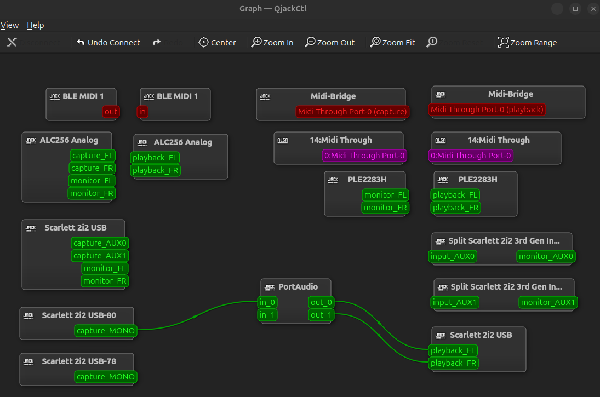
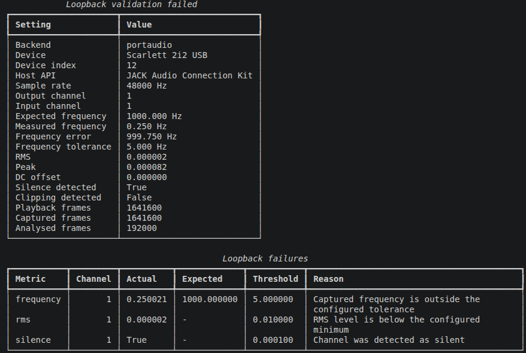
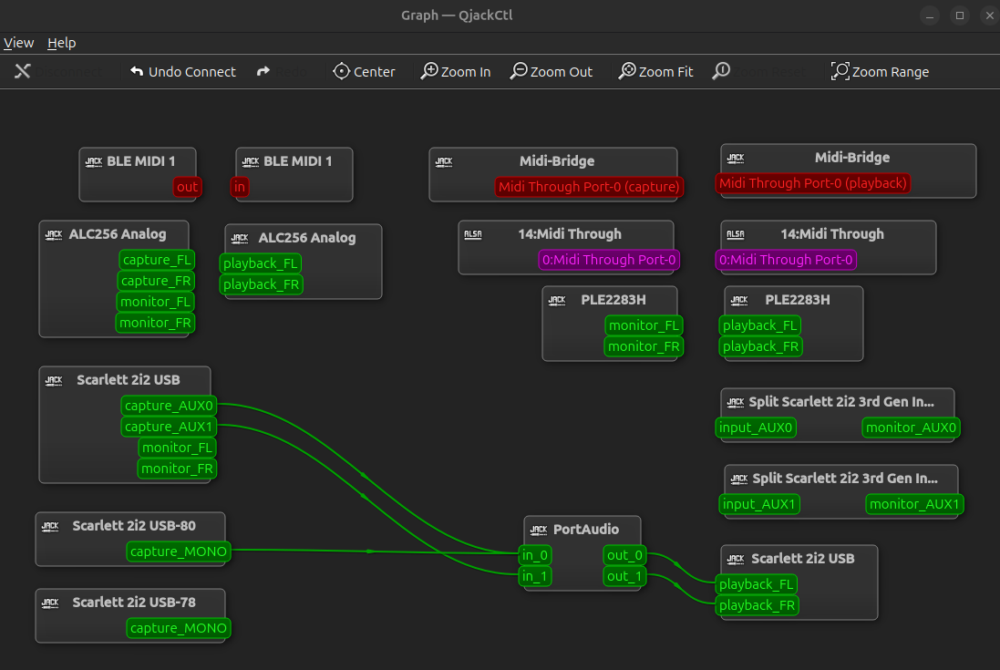
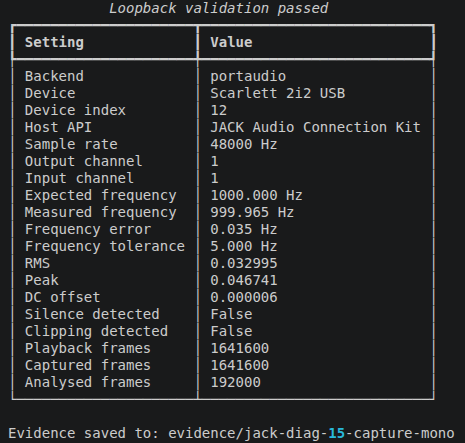

# Focusrite Scarlett 2i2 Loopback Hardware Validation

## Overview

This document records the Phase 5 physical loopback validation performed with a Focusrite Scarlett 2i2 (3rd Gen).

The purpose of the validation was to verify that the framework could execute an end-to-end hardware signal path:

```text
generated reference
       │
       ▼
configured output channel
       │
       ▼
Focusrite Scarlett 2i2 DAC
       │
       ▼
physical line-level output
       │
       │ external loopback cable
       ▼
physical line-level input
       │
       ▼
Focusrite Scarlett 2i2 ADC
       │
       ▼
captured audio
       │
       ▼
signal alignment
       │
       ▼
frequency and sample-domain validation
```

The validation also compared the behaviour of different PortAudio host APIs.

The key verified Phase 5 result is that physical end-to-end loopback succeeds through the direct ALSA Scarlett endpoint at 48 kHz.

JACK was also investigated further after Phase 5. Software-routed JACK loopback can pass without traversing the physical hardware path, while default JACK physical routing did not return the expected signal at a valid captured level.

Post-Phase 5 diagnostic testing subsequently demonstrated successful physical loopback through JACK at 48 kHz when the existing PortAudio capture routing was retained and the physical Input 1 `capture_MONO` source was additionally connected manually to `PortAudio:in_0`.

Because that connection must currently be recreated for each transient PortAudio JACK client, direct ALSA remains the primary unattended physical acceptance path.

---

## Test Hardware

Hardware:

```text
Focusrite Scarlett 2i2 (3rd Gen)
```

Physical signal path:

```text
Scarlett line output
        │
        │ line-level cable
        ▼
Scarlett line input
```

The input was configured for an appropriate line-level signal with conservative hardware gain.

Direct monitoring was disabled for the final validation and diagnostic runs.

Software monitoring paths that could create an unintended digital loopback or feedback path were also avoided when validating the physical signal path.

See [`loopback-validation.md`](loopback-validation.md) for the general physical setup and safety procedure.

---

## Software Environment

Framework:

```text
Audio Hardware Automation Framework
```

Audio backend:

```text
PortAudio
```

Python audio library:

```text
sounddevice 0.5.5
```

Primary Linux host APIs investigated:

```text
ALSA
JACK Audio Connection Kit
```

Device indexes are intentionally not recorded as stable identifiers.

PortAudio device indexes changed between discovery sessions, so validation uses device and host-API matching rather than assuming that a particular numeric index remains constant.

Some JACK device names also contained session-dependent suffixes.

The device name, host API and channel capabilities are therefore more useful validation evidence than a transient PortAudio index.

---

## Validation Configuration

The normal Phase 5 physical loopback validation used:

```yaml
stream:
  sample_rate: 48000
  input_channels: 2
  output_channels: 2
  block_size: 128
  dtype: float32

loopback:
  output_channel: 0
  input_channel: 0
  signal_duration_seconds: 1.0
  frequency_hz: 1000.0
  amplitude: 0.25
  frequency_tolerance_hz: 5.0
  padding_seconds: 0.1
```

Framework channel indexes are zero-based, so:

```text
output_channel: 0
input_channel: 0
```

represent physical Output 1 and Input 1.

The generated one-second signal contains:

```text
48,000 signal frames
```

and the configured 0.1-second padding adds:

```text
4,800 leading frames
4,800 trailing frames
```

for a total duplex playback and capture window of:

```text
57,600 frames
```

The aligned analysis window contains:

```text
48,000 frames
```

of test signal.

Dedicated host-API configurations are provided:

```text
configs/example_loopback_alsa.yaml
configs/example_loopback_jack.yaml
```

The ALSA configuration is the verified Phase 5 physical loopback path.

Post-Phase 5 diagnostic testing also demonstrated successful physical loopback through JACK at 48 kHz when the required JACK graph connection was added manually after the transient PortAudio client appeared.

The JACK configuration is therefore retained for host-API comparison and routing diagnostics, but JACK physical loopback is not currently an unattended framework-only workflow.

---

## Correction to Preliminary Testing

Some preliminary Linux loopback experiments were performed when the physical loopback connection was incomplete.

Those runs produced:

```text
ALSA
    → duplex execution completed
    → capture remained near the noise floor
    → validation failed
```

At the time, that behaviour was incorrectly interpreted as an ALSA host-API or routing problem.

Once the physical cable was correctly connected, direct ALSA at 48 kHz passed the complete physical loopback validation without issue.

The earlier ALSA failures therefore do not represent valid physical-loopback failures and are not included in the final acceptance matrix.

An earlier JACK pass was also investigated further.

That pass was produced by a software routing path inside the JACK graph rather than by the Scarlett analogue output-to-input path.

It is therefore classified as a software loopback result, not as physical hardware validation.

Correcting these interpretations is part of the final Phase 5 evidence review.

---

## Final Validation Matrix

| Environment | Stream rate | Execution result | Loopback result | Interpretation |
| --- | ---: | --- | --- | --- |
| ALSA physical loopback | 48 kHz | Executed | PASS | Verified Scarlett DAC → cable → ADC path |
| JACK software-routed loopback | 48 kHz | Executed | PASS | Digital/software signal path only |
| JACK default physical routing | 48 kHz | Executed | FAIL | Expected physical return not captured at a valid level |
| JACK `capture_MONO` replacing default route | 48 kHz | Executed | FAIL | Physical source alone was insufficient in the tested graph |
| JACK default routing + manual `capture_MONO` connection | 48 kHz | Executed | PASS | Verified physical loopback; requires manual runtime graph modification |
| JACK | 44.1 kHz | Rejected before duplex execution | Not run | PortAudio reported `Invalid sample rate` |
| ALSA | 44.1 kHz | Not retested after physical setup correction | Not run | Earlier unplugged-cable result is not valid physical-loopback evidence |
| Windows PortAudio endpoints | — | No suitable single duplex endpoint | Not run | Scarlett input and output were exposed separately |

The matrix distinguishes several different questions:

```text
Can the framework execute duplex audio?
Can a software-routed signal return through the selected host API?
Can the signal travel through the real hardware output and input path?
Can the required host routing be established automatically?
```

A successful answer to one does not automatically prove the others.

Direct ALSA remains the primary Phase 5 acceptance path because it performs physical loopback without manual host-graph intervention.

The successful JACK physical result demonstrates hardware capability through JACK, but currently requires a manual connection to the transient PortAudio client during each validation run.

---

## ALSA at 48 kHz — Physical Loopback PASS

The primary Phase 5 hardware acceptance test used the direct ALSA Scarlett endpoint at 48,000 Hz with a physical line-level cable connecting the configured Scarlett output to the configured Scarlett input.

The device reported a default sample rate of 44,100 Hz but the configured 48 kHz duplex stream opened and executed successfully.

This demonstrates that the device-reported default rate is not equivalent to the only stream rate that can be used through PortAudio.

The duplex run completed with:

```text
playback frames: 57,600
captured frames: 57,600
analysed frames: 48,000
```

A representative final run produced approximately:

```text
expected frequency:  1000.000 Hz
measured frequency:  1000.000 Hz
frequency error:     < 0.001 Hz
tolerance:           ±5.000 Hz

RMS:                 0.014242
Peak:                0.021235
DC offset:           0.000005
Silence detected:    False
Clipping detected:   False
```

No validation failures were reported.

The lower captured amplitude relative to the generated digital signal is expected for a physical analogue path whose resulting level depends on hardware output level and input gain.

This run demonstrates that the framework successfully:

- generated the configured reference signal;
- routed it to the selected hardware output;
- executed simultaneous playback and capture;
- sent the signal through the Scarlett physical output;
- received it through the Scarlett physical input;
- aligned the captured signal against the generated reference;
- recovered the expected 1 kHz dominant frequency;
- calculated sample-domain metrics;
- applied configured validation thresholds;
- returned a passing structured validation result;
- retained WAV and JSON evidence.

This is the primary Phase 5 hardware acceptance result.

---

## JACK at 48 kHz — Software Loopback PASS

A JACK validation also produced a passing result at:

```text
48,000 Hz
```

when an explicit software connection returned the generated playback signal into the capture side of the JACK graph.

The result contained:

```text
expected frequency:  1000.000 Hz
measured frequency:  1000.000 Hz

RMS:                 0.176777
Peak:                0.250000
DC offset:           approximately 0
Silence detected:    False
Clipping detected:   False
```

The RMS value is effectively the theoretical RMS of a sine wave with amplitude `0.25`:

```text
0.25 / sqrt(2) ≈ 0.176777
```

Together with the exact peak and effectively zero DC offset, this is consistent with a digital/software-routed signal rather than an analogue Scarlett output-to-input capture.

This result is useful because it demonstrates that the framework can execute, capture, align and validate audio through the JACK backend.

It is not classified as physical Scarlett loopback evidence.

Later diagnostic testing confirmed that Scarlett `monitor_*` JACK ports can similarly produce a passing software-routed result.

Those monitor-path results remain separate from the subsequently verified physical JACK loopback path.

---

## JACK at 48 kHz — Physical Loopback with Manual Runtime Routing

Post-Phase 5 diagnostic testing investigated the JACK physical-routing failure in more detail.

The tested JACK environment was PipeWire-backed and exposed several Scarlett capture paths, including:

```text
capture_AUX0
capture_AUX1
capture_MONO
monitor_FL
monitor_FR
```

The framework-created PortAudio JACK client was temporary and existed only while the duplex stream was active.

### Default routing

With the automatically established JACK routing alone, the expected physical 1 kHz return was not captured at a valid level.

Result: `FAIL`

### `capture_MONO` replacing the default Input 1 route

The physical Input 1 `capture_MONO` source was then connected directly to `PortAudio:in_0` after removing the original connection to that PortAudio input.

This configuration also failed.

A representative run produced approximately:

```text
expected frequency:  1000.000 Hz
measured frequency:  0.250 Hz

RMS:                 0.000002
Peak:                0.000082
Silence detected:    True
Clipping detected:   False
```

### Default routing plus `capture_MONO`

The successful topology retained the original PortAudio capture routing and additionally connected the physical Input 1 `capture_MONO` source to `PortAudio:in_0`

The physical output route remained:

```text
PortAudio:out_0
    ↓
Scarlett playback_FL
    ↓
physical Output L
```

A representative successful run produced approximately:

```text
expected frequency:  1000.000 Hz
measured frequency:  999.965 Hz
frequency error:     0.035 Hz
tolerance:           ±5.000 Hz

RMS:                 0.032995
Peak:                0.046741
DC offset:           0.000006
Silence detected:    False
Clipping detected:   False
```

Result: `PASS`

The retained playback, captured and analysed WAV evidence all contained the expected tone.

### Physical-path verification

The successful result was verified using cable A/B/A testing:

```text
cable disconnected
    → FAIL

cable connected
    → PASS

cable disconnected
    → FAIL
```

Changing the analogue Input 1 gain also changed the captured level while preserving the expected test frequency.

These observations demonstrate that the passing JACK result depended on the physical Scarlett output → cable → input path rather than an internal software-only loopback.

---

## Routing Evidence

### Default routing — FAIL

The default PortAudio JACK graph did not return the expected physical loopback signal.



The corresponding framework validation failed:



### Manual physical-input addition — PASS

Retaining the default capture routing and additionally connecting the physical Input 1 `capture_MONO` source to `PortAudio:in_0` produced the working physical topology:



The corresponding validation passed:



---

### Runtime-routing limitation

The working connection must currently be added manually after the framework starts.

When validation finishes, the PortAudio JACK client closes and its ports disappear.

The manually added connection therefore cannot persist between framework runs.

Physical JACK loopback is consequently verified but is not currently an unattended/repeatable framework-only workflow.

Detailed routing evidence and the remaining engineering questions are documented in [`jack-loopback-routing.md`](jack-loopback-routing.md).

---

## JACK at 44.1 kHz — Stream Rejected

The JACK configuration was also tested at `44,100 Hz`

PortAudio rejected the stream settings before duplex execution with: `Invalid sample rate`

The loopback validation therefore did not reach playback, capture or signal analysis.

This is an execution/configuration failure:

```text
JACK 44.1 kHz
    │
    └── stream rejected
        └── exit code 2
```

rather than a completed signal-validation failure:

```text
JACK 48 kHz physical-routing attempt
    │
    └── duplex execution completed
        └── captured signal below validation threshold
            └── exit code 1
```

No completed capture evidence bundle is expected when the stream is rejected before duplex execution.

---

## ALSA at 44.1 kHz

An earlier 44.1 kHz ALSA run was performed while the physical loopback connection was incomplete.

That run is therefore not valid evidence of physical loopback behaviour.

ALSA at 44.1 kHz was not required for the Phase 5 acceptance criteria and was not repeated after the physical setup was corrected.

No pass or fail claim is made for physical ALSA loopback at 44.1 kHz.

The verified physical configuration is:

```text
ALSA
48 kHz
physical output-to-input cable
PASS
```

---

## Windows Limitation

The Scarlett was also investigated through the PortAudio device topology exposed on Windows.

The usable Scarlett entries were exposed as separate input and output endpoints rather than one device index providing both directions.

The current Phase 5 duplex contract operates on one `AudioDevice` and therefore requires one selected PortAudio device with both:

```text
input channels > 0
output channels > 0
```

No suitable Scarlett endpoint was available for the current physical loopback workflow on the tested Windows configuration.

This does not mean that recording or playback is unsupported on Windows.

The framework's independent recording and playback workflows can use separate input-only and output-only device entries.

The limitation applies specifically to the current single-device duplex loopback architecture.

---

## Host API Comparison

The hardware investigation demonstrates why host API and routing topology are material parts of audio-hardware validation.

### Direct ALSA at 48 kHz

```text
stream opens
duplex executes
test tone leaves the Scarlett output
physical cable carries the signal
Scarlett input captures the signal
alignment succeeds
frequency validation passes
sample-domain validation passes
```

Result:

```text
PASS — verified physical hardware loopback
```

### JACK with explicit software loopback

```text
stream opens
duplex executes
playback signal is returned through software routing
alignment succeeds
frequency validation passes
sample-domain validation passes
```

Result:

```text
PASS — software loopback only
```

### JACK with Scarlett hardware routing

```text
stream opens
PortAudio JACK client appears
default JACK routing is established
additional physical capture_MONO route is added manually
physical cable carries the playback signal
Scarlett physical input captures the signal
alignment succeeds
frequency validation passes
sample-domain validation passes
```

Result:

```text
PASS — verified physical loopback with manual runtime routing
```

Without the additional manual runtime connection, the tested JACK graph does not produce a valid physical loopback return.

The current limitation is therefore host-routing automation rather than inability to perform physical loopback through JACK.

---

## Interpretation

The final evidence supports the following conclusions:

1. The Phase 5 loopback implementation successfully performs end-to-end physical hardware validation.
2. Direct ALSA at 48 kHz remains the primary verified physical loopback path because it works without manual host-routing intervention.
3. The Scarlett's reported 44.1 kHz ALSA default sample rate did not prevent a configured 48 kHz duplex stream from executing successfully.
4. JACK at 48 kHz can successfully validate a software-routed loopback.
5. A JACK software-loopback PASS must not be interpreted as proof that the signal travelled through the Scarlett analogue hardware path.
6. Default JACK routing did not return the expected physical loopback signal at a valid captured level.
7. Replacing the default Input 1 route with the physical `capture_MONO` source alone also failed.
8. Retaining the default JACK capture routing and additionally connecting the physical Input 1 `capture_MONO` source to `PortAudio:in_0` produced a valid physical loopback PASS.
9. Cable A/B/A testing demonstrated that the successful JACK result depended on the external physical loopback connection.
10. Changing analogue input gain changed the captured signal level, providing additional evidence that the successful result traversed the Scarlett analogue input stage.
11. The PortAudio JACK client is transient, so the required manual connection disappears when the validation stream closes.
12. Physical JACK loopback is therefore verified but is not currently an unattended framework-only workflow.
13. The reason the default capture route must remain alongside the additional `capture_MONO` connection has not yet been established.
14. The tested JACK endpoint rejected a 44.1 kHz client stream during the earlier experiment.
15. PortAudio device indexes and some JACK client identifiers are not stable enough to use as permanent hardware identifiers.
16. The tested Windows device topology does not currently provide the single duplex Scarlett endpoint required by the Phase 5 implementation.

The successful JACK diagnostics refine the earlier Phase 5 conclusion without changing its acceptance basis.

Direct ALSA at 48 kHz remains the primary unattended Phase 5 physical acceptance path.

JACK-specific routing automation remains a follow-up engineering concern.

---

## Evidence Retention

Phase 5 supports retaining a complete validation evidence bundle.

For the verified physical ALSA path:

```bash
audio-hw validate-loopback \
  --config configs/example_loopback_alsa.yaml \
  --evidence-dir evidence/linux-alsa-48k
```

A completed validation bundle contains:

```text
playback.wav
captured.wav
analysed.wav
report.json
```

This applies to both successful validations and completed validation failures.

The retained evidence was also useful during the JACK investigation.

Failing routing configurations demonstrated that valid playback evidence could coexist with an absent or near-noise-floor physical return.

The final manually routed physical JACK configuration produced valid playback, captured and analysed WAV files containing the expected approximately 1 kHz signal.

This allowed routing failures and successful physical capture to be compared using the same framework-owned evidence format.

Execution failures that occur before duplex capture, such as rejection of an unsupported sample rate, do not produce a completed loopback evidence bundle.

---

## Phase 5 Acceptance Criteria

Phase 5 required the framework to demonstrate that:

- a deterministic tone can be generated;
- the tone can be routed to a selected hardware output;
- playback and capture can execute through a duplex backend;
- the captured signal can be aligned against the known reference;
- dominant frequency can be measured;
- RMS and peak level can be measured;
- silence and clipping can be detected;
- validation failures identify the affected metric and channel;
- raw playback and captured audio can be retained as evidence;
- structured JSON evidence can be exported;
- the workflow can be validated against physical audio hardware.

These criteria were satisfied by the successful direct-ALSA 48 kHz Focusrite physical loopback run together with the hardware-independent automated regression suite.

The JACK investigation also demonstrated that the framework correctly distinguishes a valid captured signal from an effectively absent physical return.

Phase 5 is therefore complete.

---

## JACK Routing Follow-Up

The post-Phase 5 investigation established that physical JACK loopback is possible when the existing PortAudio capture routing is retained and the physical Input 1 `capture_MONO` source is additionally connected to `PortAudio:in_0`.

The remaining work is therefore focused on routing automation and lifecycle rather than basic physical-path discovery.

Potential follow-up areas include:

- determining why the default capture route must remain alongside `capture_MONO`;
- identifying which component establishes the default PortAudio JACK connections;
- determining whether the required physical-input connection can be created automatically when the transient PortAudio client appears;
- deciding whether JACK graph policy belongs in the framework or in host-environment configuration;
- evaluating whether this work belongs alongside planned flexible endpoint selection.

See [`jack-loopback-routing.md`](jack-loopback-routing.md) for the detailed diagnostic evidence.

This work remains outside the completed Phase 5 acceptance scope.

---

## Remaining Scope

The current loopback implementation does not yet provide:

- measured round-trip latency as a reported validation metric;
- calibrated analogue voltage measurements;
- frequency-response sweeps;
- total harmonic distortion;
- THD+N;
- signal-to-noise ratio;
- channel crosstalk measurements;
- long-duration stability testing;
- automatic recovery or hot-plug stress testing;
- separate-device input/output duplex execution.

These remain candidates for later phases.